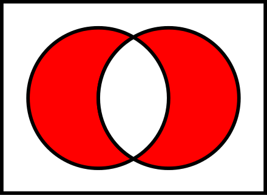

# Questions

## What is the difference between remove() and discard() ?

Both `remove()` and `discard()` is used to remove an element from Set. The only difference is `discard()` does not return error if the element does not exist in Set. The best example of this use-case is to `get set of jenkins jobs run a specific node but ignore job with name test-job`.

## Can you perform pop() operation on Sets ?

Yes `pop()` method can be used on Sets. However, Sets are unordered, So performing `pop()` may be result in removing an unwanted element.

## What is the difference between difference() and symmetric_difference() ?

symmetric_difference() returns a set that contains all items from both sets, except items that are present in both sets.

Symmetric Difference:



## Can I add List to a Set in Python ?

Yes. Output will be a Set.

### Question

Write a program to verify if two lists have at-least one element in common.

```python
def intersection(a, b):
    s1 = set(a)
    s2 = set(b)
    return s1.intersection(s2)

if __name__ == "__main__":
    # Create two lists of your choice.
    a = [10, 12, 31, 44, 56]
    b = [16, 71, 98, 91, 10]
    s3 = intersection(a, b)

    if len(s3) > 0:
        print("True")
    else:
        print("False")
```
