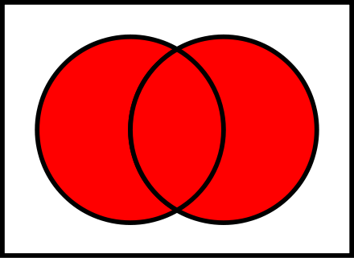
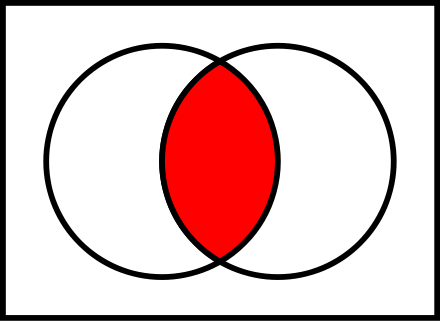
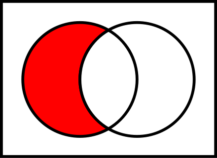

# Set Methods

Below are the in-built Set methods supported by Python.

* `add()`
* `clear()`
* `copy()`
* `difference()`
* `difference_update()`
* `discard()`
* `intersection()`
* `intersection_update()`
* `isdisjoint()`
* `issubset()`
* `issuperset()`
* `pop()`
* `remove()`
* `symmetric_difference()`
* `symmetric_difference_update()`
* `union()`
* `update()`

Let's take a look into the in-built Set functions. The below programs explains the usage of all the built-in functions.

## Write a Function to demonstrate add(), copy(), remove() and discard() methods on Sets.

```python
# Create a Set
print("Create a Set s")
s = {"red", "blue", "green"}
print(s)

# Add
print("\n Add Method")
print("Add a new color Orange")
s.add("orange")
print(s)

# Copy 
print("\n Copy Method")
print("A new Set s1 is created")
s1 = s.copy()
print(s1)

# Remove
print("\n Remove Method")
print("Remove Orange from s1")
s1.remove("orange")
print(s1)

# Discard
print("\n Discard Method")
print("Discard is similar to remove, but does not throw any error if element does not exist")
s1.discard("elephant")
```

Output:

```txt
Create a Set s
{'blue', 'red', 'green'}

Add Method
Add a new color Orange
{'orange', 'blue', 'red', 'green'}

Copy Method
A new Set s1 is created
{'orange', 'blue', 'red', 'green'}

Remove Method
Remove Orange from s1
{'blue', 'red', 'green'}

Discard Method
Discard is similar to remove, but does not throw any error if element does not exist
```

## issubset() vs issuperset()

* `issubset()` returns **true**, if the set is subset of another set.
* `issuperset()` returns **true**, if this set contains another set.

```python
s = {"red", "blue", "green", "orange"}
s1 = {"red", "blue", "green"}

print(s1.issubset(s))
print(s.issuperset(s1))
```

Output:

```txt
True
True
```

## **MATH Operations**

## union() vs update()



* `union()` creates a new set with union(all) of two or more sets.
* `update()` updates the set with `union()` of all the sets.

```python
s = {"red", "blue", "green", "orange"}
s1 = {"red", "blue", "green, white"}

# Union
print("\n Union Method")
print("Get union of s and s1")
print(s.union(s1))

print("set s")
print(s)
print("set s1")
print(s1)

# Update
print("\n Update Method")
s.update(s1)

print("set s")
print(s)
print("set s1")
print(s1)
```

Output:

```txt
Union Method
Get union of s and s1
{'green, white', 'green', 'blue', 'orange', 'red'}
set s
{'blue', 'green', 'orange', 'red'}
set s1
{'blue', 'red', 'green, white'}

Update Method
set s
{'green, white', 'green', 'blue', 'orange', 'red'}
set s1
{'blue', 'red', 'green, white'}
```

## intersection vs intersection_update()



* `intersection()` returns a new set containing the intersection(elements in common) of two or more sets.
* `intersection_update()` updates the same set with the output of `intersection()`.
  
```python
s = {"red", "blue", "green", "orange"}
s1 = {"red", "blue", "green"}

# Intersection
print("\n Intersection Method")
print("Get intersection of s and s1")
print(s.intersection(s1))

print("set s")
print(s)
print("set s1")
print(s1)

# Intersection Update
print("\n Intersection Update Method")
s.intersection_update(s1)

print("set s")
print(s)
print("set s1")
print(s1)
```

Output:

```txt
Intersection Method
Get intersection of s and s1
{'blue', 'red', 'green'}
set s
{'blue', 'red', 'orange', 'green'}
set s1
{'blue', 'red', 'green'}

Intersection Update Method
set s
{'blue', 'red', 'green'}
set s1
{'blue', 'red', 'green'}
```

## Difference vs Difference Update



* `difference()` returns a new set containing the difference of two or more sets.
* `difference_update()` updates the same set with the output of `difference()`.

Lets take a deeper look by scripting it down.

```python
s = {"red", "blue", "green", "orange"}
s1 = {"red", "blue", "green"}

# Difference
print("\n Difference Method")
print("Get difference of s and s1")
print(s.difference(s1))

print("set s")
print(s)
print("set s1")
print(s1)

# Difference Update
print("\n Difference Update Method")
s.difference_update(s1)

print("set s")
print(s)
print("set s1")
print(s1)
```

Output:

```txt
Difference Method
Get difference of s and s1
{'orange'}
set s
{'red', 'orange', 'green', 'blue'}
set s1
{'red', 'green', 'blue'}

Difference Update Method
set s
{'orange'}
set s1
{'red', 'green', 'blue'}
```
